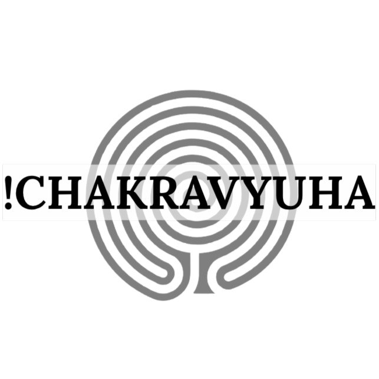

# Chakravyuha: A Web-Based C/C++ Obfuscation Service

  <!-- Status & License Badges -->
  
  
   
  <!-- Tech Stack Badges -->
  
  
  
  
  <!-- Deployment Badges -->
  
  

  

<h3 align="center"><i>The Impenetrable Code Formation</i></h3>

This repository contains the source code for a web service that demonstrates the **Chakravyuha obfuscation engine**, a powerful proof-of-concept tool for protecting C/C++ applications from reverse engineering. Built on the robust LLVM compiler framework, this service showcases multiple advanced obfuscation passes designed to dismantle static analysis and frustrate manual decompilation.

The live service is hosted at: **[https://chakravyuha-obfuscator.github.io/](https://chakravyuha-obfuscator.github.io/)**

---

## Core Obfuscation Techniques

Chakravyuha integrates several state-of-the-art obfuscation passes. Each is designed to attack a different aspect of the reverse engineering process.

### 1. Fully Polymorphic String Encryption
This pass is designed to hide sensitive string literals from static analysis tools.

*   **What it does:** It finds constant strings (like API keys, passwords, or hidden messages) and encrypts them directly within the binary. Each string is encrypted with a unique, randomly generated key and one of several polymorphic cipher routines (XOR, ADD, SUB). A small, self-modifying decryption stub is injected to restore the original string in memory just-in-time for its use.
*   **Defense Mechanism:** This technique completely defeats static string searching tools (like `strings`). Because the decryption stubs are polymorphic and self-modifying, they lack a consistent signature, making it extremely difficult for an attacker to automate the decryption process across the entire binary.

### 2. Control Flow Flattening (Beta)
This is a powerful technique that obscures the program's execution logic by destroying its natural structure.

*   **What it does:** It deconstructs a function's body into a collection of basic blocks and places them inside a single, massive `switch` statement controlled by a state variable. The original control flow (e.g., `if/else` blocks, `for` loops) is replaced by a dispatcher that updates the state variable, effectively turning the function into an unrecognizable finite-state machine.
*   **Defense Mechanism:** This pass renders the function's Control Flow Graph (CFG) nearly useless. Tools like IDA Pro, which rely on graphing the CFG to help analysts understand program logic, will instead display a confusing "star" or "fan" shape with dozens of edges originating from a single dispatcher block. This forces an analyst to manually trace the state variable's changes, a tedious and error-prone task.

### 3. Fake Code Insertion (Bogus Control Flow)
This pass pollutes the binary with deceptive code paths to mislead and exhaust static analysis tools and human analysts.

*   **What it does:** It injects valid but non-functional code blocks into functions. These blocks are guarded by opaque predicates—conditions that always resolve to `false` at runtime but are computationally difficult for a decompiler to prove. These "dead" blocks appear as legitimate execution paths in the CFG.
*   **Defense Mechanism:** This technique acts as a series of traps for reverse engineers. It dramatically increases the perceived complexity of the code, sending analysts down time-wasting rabbit holes as they attempt to understand the purpose of code that will never actually execute.

---

## Web Platform Features

The web service provides an intuitive interface for experimenting with the Chakravyuha engine.

*   **Interactive Code Editor:** Paste C or C++ code directly into a full-featured editor with syntax highlighting.
*   **Language Selection:** Explicitly choose between C and C++ compilation for pasted code to ensure the correct compiler is used.
*   **File Upload:** Drag and drop or upload `.c` and `.cpp` files for automatic language detection.
*   **Configurable Pipelines:** Run individual obfuscation passes or a full pipeline with multiple cycles.
*   **Detailed Obfuscation Reports:** Receive a comprehensive report after each run, detailing IR size changes, executable size changes, and metrics for each obfuscation pass.
*   **Control Flow Graph (CFG) Visualization:** Optionally generate a side-by-side visual comparison of a function's CFG before and after obfuscation to see the dramatic effect of Control Flow Flattening.

---

## Architecture

This service uses a modern, containerized, client-server model:

*   **Frontend:** A static HTML/CSS/JS user interface hosted on **GitHub Pages**.
*   **Backend:** A Node.js server running inside a **Docker container**, hosted on **Render**.
*   **Obfuscation Core:** The C++ LLVM passes that are compiled and executed securely inside the Docker container.

This monorepo contains the code for all three components.

---

## How to Deploy This Project Yourself

### Prerequisites

*   A [GitHub](https://github.com) account.
*   A [Render.com](https://render.com) account.
*   [Git](https://git-scm.com/) and [Node.js](https://nodejs.org/) installed locally.

### Deployment Steps

**1. Fork and Clone the Repository:**
   Fork this repository to your own GitHub account, then clone it locally.

**2. Deploy the Backend to Render:**
   - On the Render dashboard, click **New +** -> **Web Service**.
   - Connect your forked GitHub repository and set the **Environment** to **Docker**.
   - After the build, Render will provide you with a public URL.

**3. Update and Deploy the Frontend to GitHub Pages:**
   - Open `index.html` and replace the `backendUrl` constant with your Render URL.
   - In your GitHub repository settings, enable GitHub Pages for the `main` branch.

Your web service is now live.

---

### Local Development

1.  **Prerequisites:** A Linux build environment with `clang`, `llvm-dev`, `cmake`, and `nodejs`.
2.  **Build:** Run `npm install`, then build the C++ passes: `mkdir build && cd build && cmake .. && cmake --build .`.
3.  **Run:** From the root directory, run `node server.js`.
4.  **Test:** Open `index.html` in your browser.